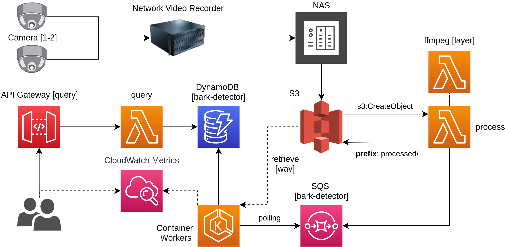

# Dog Bark Detection



## Conda Environment

```bash
conda env create -f environment.yml
conda activate dog-bark
```

### Run Prediction

```bash
QUEUE_NAME=<queue_name> TABLE_NAME=<table_name> python3 main.py
```

## Docker

```bash
docker build -t dog-bark .
docker run --env QUEUE_NAME=<queue_name> --env TABLE_NAME=<table_name> dog-bark
```

### Kubernetes

```bash
gcloud auth login
gcloud config set project <PROJECT>

docker build -t gcr.io/<PROJECT>/bark-detector:latest .
docker push gcr.io/<PROJECT>/bark-detector:latest

# When connected to Kubernetes
kubectl apply -f deploy.yml
```

## Attribution

* [Sound Classification using Deep Learning](https://medium.com/@mikesmales/sound-classification-using-deep-learning-8bc2aa1990b7)
